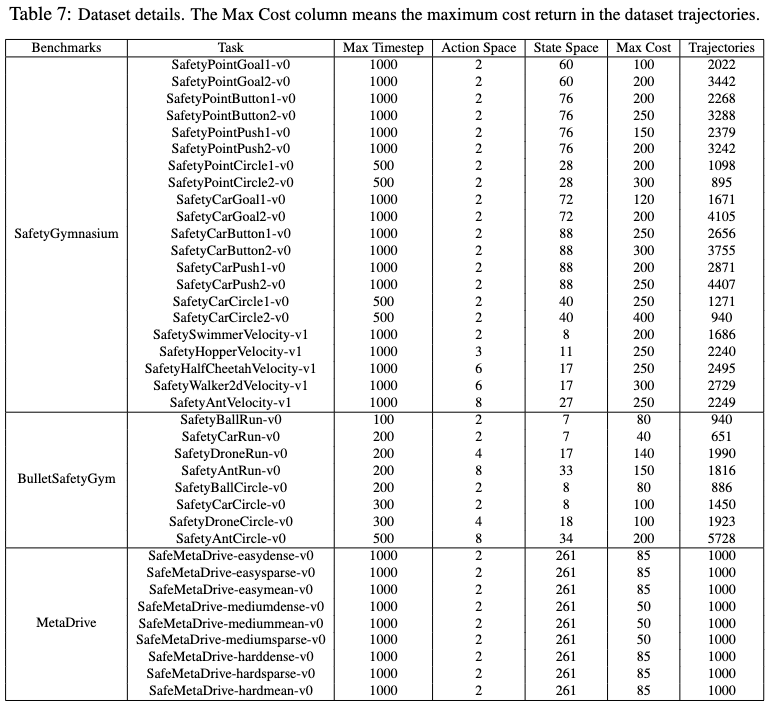
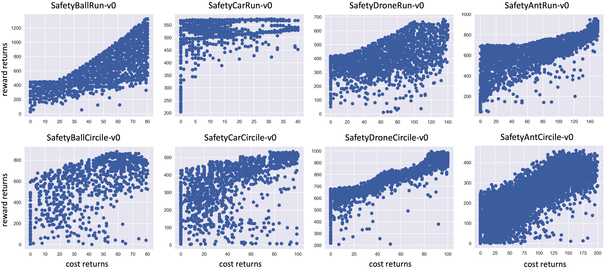
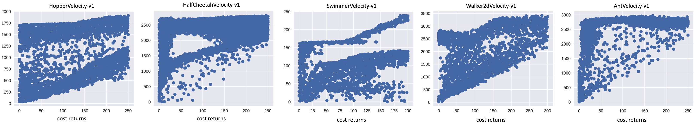
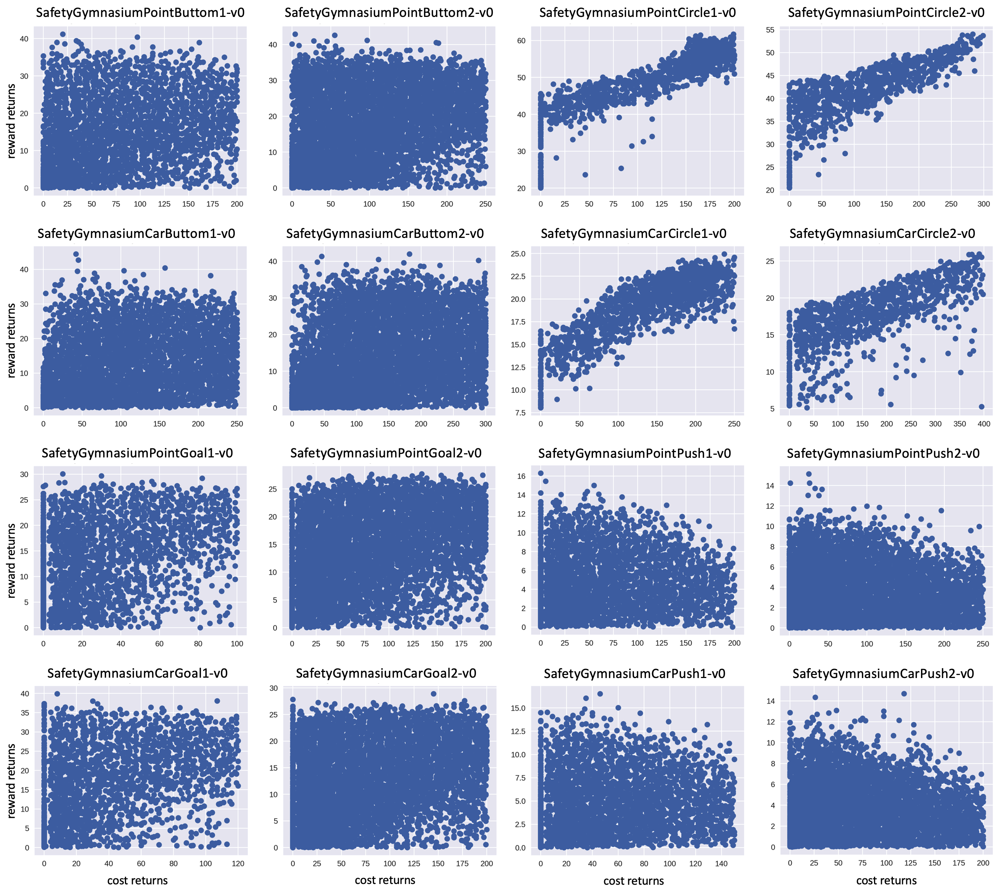
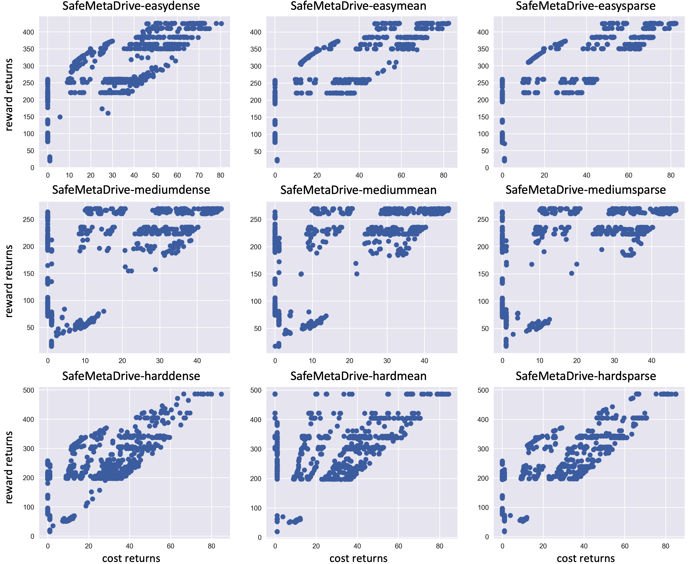

# Dataset Documentation and Visualization

## Dataset Breakdown Details

The datasets provided in this release are specifically designed for use in the research and development of offline safe learning algorithms. These datasets are diverse over the cost-reward return space, spanning across three unique safe RL environments, and are built to rigorously test algorithms across a variety of safety thresholds. 

A detailed breakdown of environments, tasks, and data sizes can be found in the below table. The "Max Cost" column in the table specifies the maximum cost return in the dataset trajectories.

  

## Dataset cost-reward-return plot visualization

Let's now visualize the cost-reward-return plot, where each dot represents trajectories with corresponding cost and reward returns. For every trajectory, we calculate its total reward and total cost. These points, when plotted on a two-dimensional plane where the x-axis represents the total cost and the y-axis represents the total reward, create a scatter plot that portrays the trade-offs between reward maximization and constraint satisfaction.

*Visualization of BulletSafetyGym dataset trajectories on the cost-reward return space.*

*Visualization of Velocity dataset trajectories on the cost-reward return space.*

*Visualization of SafetyGymnasium dataset trajectories on the cost-reward return space.*

*Visualization of MetaDrive dataset trajectories on the cost-reward return space.*

Analyzing the figures provided, it is generally observed that as cost return increases, so too might the reward return, underscoring the inherent trade-off between reward and cost. This trend aligns with the findings discussed in previous works ([[1]](https://arxiv.org/abs/2205.14691), [[2]](https://arxiv.org/abs/2201.11927)). This trend is particularly pronounced in BulletSafetyGym tasks and velocity tasks, as these tasks are largely deterministic - their initial states and transition dynamics are not heavily influenced by randomness. 

In contrast, the same clear increasing trend is not observable in many highly stochastic SafetyGymnasium tasks, such as Goal, Button, and Push. For instance, in the Goal task, random initialization might result in a direct path between the agent's start position and the goal, enabling the completion of the task with zero constraint violations. 

For the autonomous driving tasks in MetaDrive, the cost results from three safety-critical scenarios: (i) collision, (ii) out of road, and (iii) over-speed. In this case, the environment's stochasity mainly comes from the random initialization of surrounding traffic flows and the map configuration.

It's worth noting, however, that even though the cost-reward return plot of the dataset might not accurately reflect the reward-cost trade-off, the training curves of the expert policies do display a significant trend. This is because each policy is evaluated on multiple episodes and uses expectations as the evaluation metrics. 

[^1^]: Liu, Zuxin, et al. "On the robustness of safe reinforcement learning under observational perturbations." ICLR, 2023.

[^2^]: Liu, Zuxin, et al. "Constrained variational policy optimization for safe reinforcement learning." International Conference on Machine Learning. PMLR, 2022.
